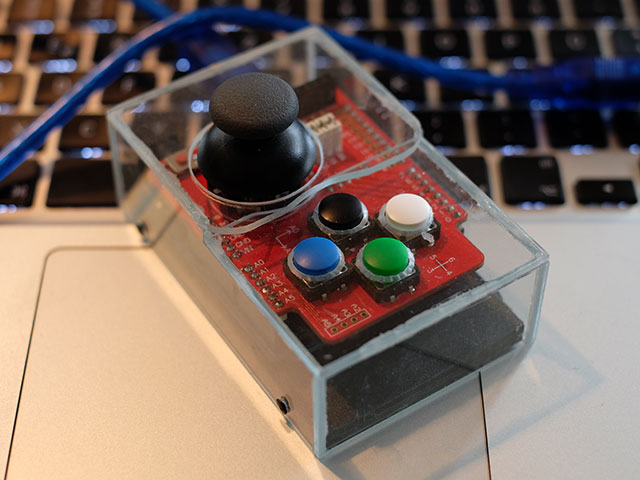

# The Arduino MIDI Joystick ArMiJoy

This sketch turns your OpenJumper Joystick Shield into a MIDI input device.

## Libraries

Two libraries are needed:

Library  | Description
-------  | ----------
MIDI     | MIDI I/O on the Arduino serial ports. [Github](https://github.com/FortySevenEffects/arduino_midi_library/releases/tag/4.2), [Doku](http://arduinomidilib.fortyseveneffects.com/index.html)
Joystick | Library for the OpenJumper Joystick Shield. [Github](../Joystick)

 
## Functionality

The axes control velocity (X-Axis, e.g. volume) and pitch (Y-Axis, please use a compatible instrument).

The four small buttons act like piano keys. They play a major chord.

Press the knob (button select) to change the base note: D A G D A G ...

## Connection

If you have your own MIDI hardware you can equip the ArMiJoy with a MIDI connector. Arduino.cc has a [Tutorial](http://www.arduino.cc/en/Tutorial/Midi) on this.

Since I do not have such hardware I decided to use USB-MIDI instead. [Hiduino](https://github.com/ddiakopoulos/hiduino) provides firmwares for building a class-compliant USB-MIDI device from an Arduino UNO or Mega 2560. 

To upload the firmware you need an ISP programmer. I used another UNO and the ArduinoISP.ino which is a default Arduino example. 3 LEDs, a little wiring, and the ISP is ready for use, see [ArduinoISP](../ArduinoISP) for details.

Now you can use the ArMiJoy with your MIDI software. 

