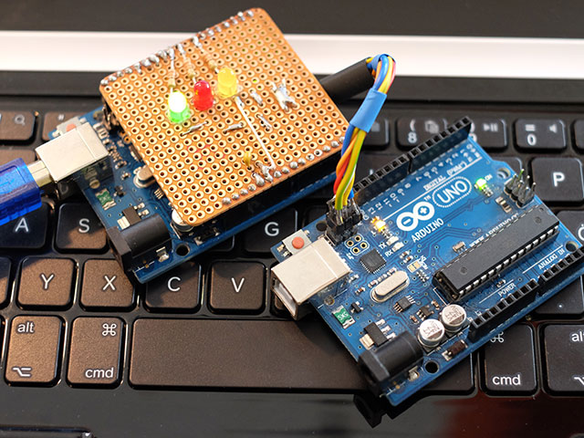
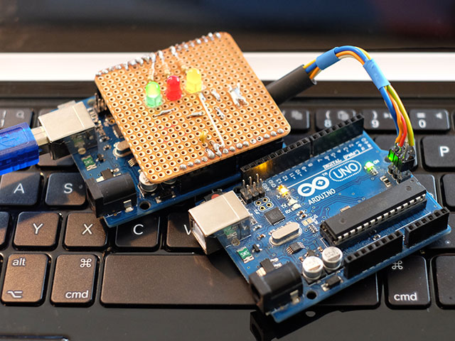

# ArduinoISP

## Prepare Programmer

ArduinoISP.ino explains how to turn your UNO into an programmer for the ATmega328. If you want to change the firmware you have to use the ICSP-Header.

(...)

## Update Firmware

Connect programmer to ATmega16U2 (see photo).

(...)

## Update Bootloader

Connect programmer to ATmega328 (see photo).

(...)
