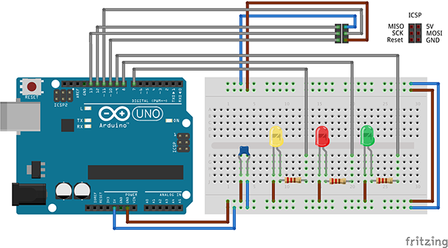
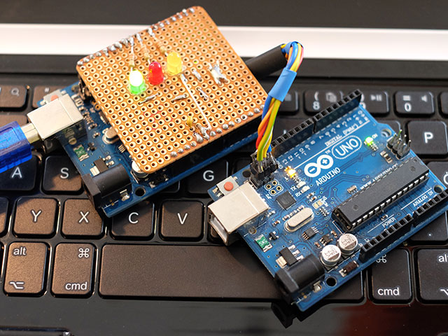
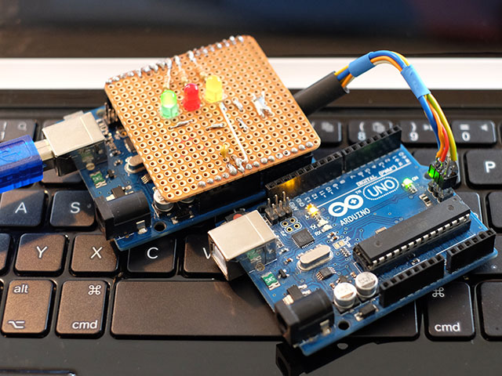

# ArduinoISP

ArduinoISP.ino is part of the Arduino software and explains how to turn your UNO into an programmer for the ATmega328. If you want to change the firmware on the ATmega16U2 you have to use the ICSP header.

## Wiring

## Programming

### Avrdude

Avrdude is a command line tool to program microcontroller. It is part of the Arduino software.

File | Description
---- | ----
avrdude | Command line tool (OS X): `Arduino.app/Contents/Java/hardware/tools/avr/bin/avrdude`
avrdude.conf | Configuration file (OS X): `Arduino.app/Contents/Java/hardware/tools/avr/etc/avrdude.conf`
firmware.hex | Default UNO firmware (OS X): `Arduino.app/Contents/Java/hardware/arduino/avr/firmwares/atmegaxxu2/arduino-usbserial/Arduino-usbserial-atmega16u2-Uno-Rev3.hex`
bootloader.hex | Default UNO bootloader (OS X): `Arduino.app/Contents/Java/hardware/arduino/avr/bootloaders/optiboot/optiboot_atmega328.hex`

### Programming the ATmega16U2

The firmware is the piece of software that runs on the ATmega16U2 and connects the computer's USB port to the ATmega328 serial port.

The default firmware act like a serial port. You can change the firmware if you into need a different behaviorur, e.g to build a USB-MIDI device.

Connect programmer to ATmega16U2 (see photo) and use `avrdude` to upload the firmware.

	avrdude -C configfile -c programmer -P port -b baudrate -p partno -vvv -U flash:w:firmware.hex:i

Parameter | Value | Description
---- | ----
-C configfile | `avrdude.conf` | See above
-c programmer | `avrisp` | ArduinoISP
-P port | `/dev/tty.usbmodem1421` | The serial port, sometimes also `-P /dev/tty.usbmodem1411`
-b baudrate | `19200` | The serial baud rate
-p partno | `m16u2` | 
-vvv | | Very verbose output
-U memtype:operation:filename:format| `flash:w:firmware.hex:i` | The m16u2 has `flash`memory and we want to `w`rite `firmware.hex` which has `i`ntel format.

	$ cd Arduino.app/Contents/Java/hardware/tools/avr/bin
	$ ./avrdude -C ../etc/avrdude.conf  -c avrisp -P /dev/tty.usbmodem1421 -b 19200 -p m16u2 -vvv -U flash:w:../../../arduino/avr/firmwares/atmegaxxu2/arduino-usbserial/Arduino-usbserial-atmega16u2-Uno-Rev3.hex:i

### Programming the ATmega328

The bootloader is the piece of software that commonly runs on the ATmega328 and is responsible for storing your sketch during upload. The ATmega328 is the Arduino's main processor.

If you do not use the default firmware or need all the available space for your sketch you can use a programmer connected to the ICSP header to upload your sketch.

Connect programmer to ATmega328 (see photo).

#### Upload Your Sketch

You can upload your sketch using the Arduino IDE.

- Set `Tools > Programmer > Arduino as ISP`
- Set the target board, e.g. `Arduiono Uno`
- Set the serial port yourt programmer is connected to, e.g. `/dev/tty.usbmodem1421`
- Upload with `File > Upload Using Programmer`

#### Set Fusebits

The microcontroller has 3 bytes of permanent storage, the fuses. The fuses determine how the chip will act, whether it has a bootloader, what speed and voltage it likes to run at, etc.

Use follwing command to be able to write the bootloader on the ATmega328:

	$ cd Arduino.app/Contents/Java/hardware/tools/avr/bin
	$ ./avrdude -P /dev/tty.usbmodem1421 -b 19200 -c avrisp -p m328p -v -e -U efuse:w:0x05:m -U hfuse:w:0xD6:m -U lfuse:w:0xFF:m

#### Upload Bootloader

The bootloader is uploaded like this:

	$ cd Arduino.app/Contents/Java/hardware/tools/avr/bin
	$ /avrdude -P /dev/tty.usbmodem1421 -b 19200 -c avrisp -p m328p -v -e -U flash:w:../../../arduino/avr/bootloaders/optiboot/optiboot_atmega328.hex -U lock:w:0x0F:m`

