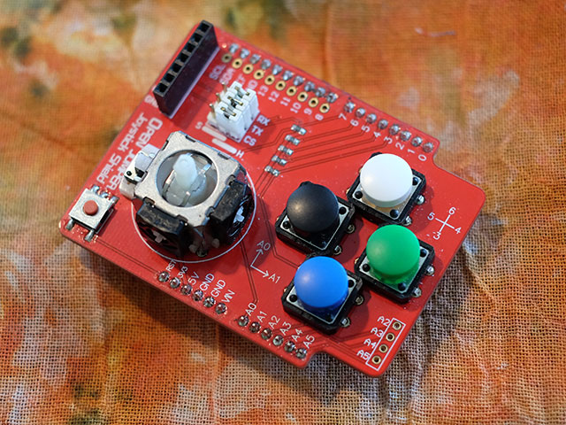

# Joystick Library



This library allows your sketches to communicate with the OpenJumper Joystick Shield.

## Installation

Copy this folder to your Arduino libraries folder and (re)start Arduino.

## Usage

### Create Joystick Object

Include the library and create an Joystick object.

```
#include <Joystick.h>
Joystick joystick;
```

### Define Callback Functions

Have a callback function for each axis or button you intend to use.

```
void onAxisX(float position){
	// -100.0 - leftmost
	//    0.0 - middle
	//  100.0 - rightmost
	
}
void onButtonLeft(bool pressed){
	// true  - button is down
	// false - button is up
}
```

### Register Callback Functions

#### Axes

Register your callback functions for the axes.

```
void setup() {
    joystick.onAxis(Joystick::X, &onAxisX);
}
```

The board has 2 axes: X and Y.

Axis        | Description
----------- | -----------
Joystick::X | The horizontal axis
Joystick::Y | The vertical axis

You can specify an analog pin if your shield has a different layout.

```
void setup() {
    joystick.onAxis(Joystick::X, analogPin, &onAxisX);
}
```


#### Buttons

Register your callback functions for the buttons.

```
void setup() {
    joystick.onButton(Joystick::Left, &onButtonLeft);
}
```

The board has 5 buttons: Left, Down, Up, Right, and Select.

Button          | Description
--------------- | -----------
Joystick::Left  | The blue button
Joystick::Down  | The green button
Joystick::Up    | The black button
Joystick::Right | The white button
Joystick::Select| The button inside the rocker arm.

You can specify a digital pin if your shield has a different layout.

```
void setup() {
    joystick.onButton(Joystick::Left, digitalPin, &onButtonLeft);
}
```

### Process

Call process() from loop() to bring the joystick to life.

```
void loop() {
    joystick.process();
}
```

## Example

The [JoystickDemo](./examplaes/JoystickDemo) shows the usage of all axes and buttons reports. Activity is reported via serial interface.


